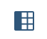

# Exercise 4 - Extension capabilities in Manufacturing Insights

## Exercise 4.1 Creating a dashboard using Embedded SAP Analytics Cloud _(eSAC)_ capabilities in SAP Digital Manufacturing

In this exercise, we will create a dashboard using the **Manage Dashboards** app in SAP Digital Manufacturing.

1. Open the SAP Digital Manufacturing UI in your browser.
2. Go to the app **Manage Dashboards**. _Tip - Use the Search at the top of the UI to find the app._
3. Click on the **Create** button to create a new dashboard.
4. This opens the Query Designer in eSAC.
5. On the right-hand side panel, you'll notice the list of available data sources in the form of **Manufacturing Data Objects (MDOs)**
6. Expand the **Manufacturing Data Objects** and notice the list of available MDOs.
7. Drag and Drop the **SFCProductionEvents** MDO onto the canvas.
8. Click on the **SFCProductionEvents** tile on the canvas and click the **Select columns** icon 
9. Check all of the available columns and click outside the dialog to close it.
10. _Optional_ Select the filter options and apply the plant filter to filter the results only for the plant assigned to you for the exercise
11. Click on the **Preview Query** button at the bottom right-hand side of the UI
12. This will show you the data that will be fetched by the query
13. Click on Finish. Provide a name to the Datasource in the dialog that opens, e.g. User_Exercise4_Query and click on **Save**.
14. This now takes you to the designer to create the dashboard/story.
15. Select the **Table** visualization
16. In the **Builder** panel on the right-hand side, click on the **+ Add Measures/Dimensions** link
    1. Select the below Dimensions
       1. Plant
       2. Order
       3. Sfc
       4. Material
       5. EventType
       6. EventOccurredAt
       7. Routing
       8. RoutingStep
       9. OperationActivity
       10. Resource
    2. Select the below Measures
       1. Quantity
17. You will observe the table getting updated with the selected columns
18. In order to simplify our report, let's add a few filters as well
19. From the top menu, select **Add Story Filter/Prompt**. This will add a filter to the top/left of the page. _Note that you may have to click on **More** and then **Add Story Filter/Prompt** if the option is not visible._
20. Click on the Filter icon and provide the filtering criteria as below:
    1. Dimensions --> Plant
       1. In the **Set Filters for Plant** dialog, select  **All Members** and click on **OK**
    2. Dimensions --> Order
       1. In the **Set Filters for Order** dialog, select  **All Members** and click on **OK**
    3. Dimensions --> Sfc
       1. In the **Set Filters for Sfc** dialog, select  **All Members** and click on **OK**
21. Click on the **Plant** filter and select the plant assigned to you for the exercise. Click on **Apply Selection**
22. From the top menu, select **Save*. This will open a dialog to provide a name and description for the dashboard/story. _Note that you may have to click on **More** and then **Save** if the option is not visible._
23. Provide a name and description for the dashboard/story and click on **Save**.
24. Click on the **SAP** logo on the top left of the UI to take you to the home screen.
25. Click on the **Manage Dashboards** app to see the list of available dashboards.
26. Click on the dashboard/story that you just created to view the dashboard.
27. You can now explore the dashboard and the data that is displayed in the table.
28. Set the filters for the Plant, Order and SFC to the values assigned to you for the previous exercises.
29. Verify the data displayed in the table with the interactions performed via the Workcenter POD in the previous exercises.
30. _Optional_ You can also explore the other MDOs and visualizations available in eSAC to create your own dashboards.

## Exercise 4.2 Explore the APIs on Manufacturing Data Objects

SAP Digital Manufacturing also provides the ability to use APIs to retrieve the data in MDOs and use it in custom apps. 
In this exercise, we'll use a client like Postman to explore the APIs available on the MDOs.

1. Open Postman and create a new collection
2. Add a new request 
3. Provide a name for the request, e.g. **Get Token**
4. Select the **Get** method
5. The URL will be provided by the speakers during the session
6. Set the Authorization to **Basic Auth** and provide the username and password provided by the speakers during the session
7. Click on **Send** to execute the request
8. You should see a response with the access token
9. Copy the access token 
10. Create another request in the same collection
11. Provide a name for the request, e.g. **Get metadata**
12. Select the **Get** method
13. The URL will be provided by the speakers during the session
14. Set the Authorization to **Bearer Token** and paste the access token copied in the previous step
15. Click on **Send** to execute the request
16. You should see a response with the metadata for the available OData endpoints for the MDOs
17. Create another request in the same collection
18. Provide a name for the request, e.g. **Get SFCProductionEvents**
19. Select the **Get** method
20. The URL will be provided by the speakers during the session
21. Set the Authorization to **Bearer Token** and paste the access token copied in the previous step
22. Click on **Send** to execute the request
23. You should see a response with the data for the SFCProductionEvents MDO
24. Modify the request and add the filter for your order and sfc. e.g. $filter=Order eq 'xyz' and Sfc eq 'abc'&$format=json 
25. Click on **Send** to execute the request
23. You should see a response with the data for the SFCProductionEvents MDO
26. You can now explore the other MDOs and APIs available in SAP Digital Manufacturing
## Summary

You now have hands-on experience on building custom dashboards using the embedded SAP Analytics Cloud capabilities in SAP Digital Manufacturing. 
You also have an understanding of the APIs available on the Manufacturing Data Objects that can be used to build custom applications/dashboards/reports.

